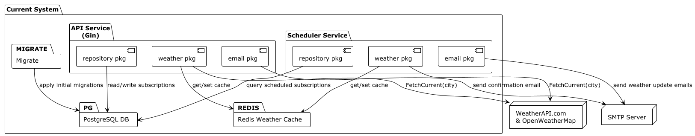

# Weather API – Weather Notification Service

## Self-hosted HTTP-only deployment:
http://79.184.28.62:8080/api/weather/?city=Kyiv

Should be up most of the time

## Purpose and Features

- **Weather Updates via Email:**
Users can subscribe an email address to receive weather forecasts for a chosen city.
The service will send periodic weather updates to the subscriber’s email.
First email sending is scheduled the next minute after subscription confirmation.
- **Scheduler:** Scheduler service staggers emails sending in time, to not overload SMTP server exactly at *xx:00:00*.
The exact *hour* and *minute* of subscription confirmation are stored in DB.
`Scheduler` wakes up every minute and sends emails scheduled for *current* minute (or for current *hour:minute*).
Implemeted as database queries:

        DailyBatch(ctx context.Context, current_hour, current_minute int) ([]Subscription, error)
        HourlyBatch(ctx context.Context, minute int) ([]Subscription, error)

  And then `Scheduler` sends current-minute-batches (hourly and daily) using common TCP/TSL connection per batch.
- **Multiple Weather Data Sources for Redundancy:** The app integrates with external weather APIs (WeatherAPI.com and OpenWeatherMap) to have it backed up for the case, when one is out of order.
- **Weather data caching:** To not overload third-party weather api endpoints, Redis cache is used to store weather cache per each city. `5 minutes` cache timeout is set as default value.
- **PostgreSQL Database:** Subscription data is persistent between launches. All operations are atomic. `Api` service reads/writes subscription data atomically. `Scheduler` service only reads data in batches also atomically.
- **Email Confirmation:** Subscription uses a double opt-in process – users receive a confirmation email with a link to activate their subscription. An unsubscription link is also provided in notification emails to allow users to opt out easily.
- **Tech Stack:** Written in Go, using the Gin framework for the API. Data is stored in PostgreSQL, Redis is used for caching weather data, and emails are sent via SMTP. A background scheduler (in Go) handles periodic email dispatch. CI is set up with GitHub Actions for testing on each push.

## Current Architecture Components Diagram:



## Possible Architecture Enhancements:

- **Dedicated Asynchronous Email Worker (behind RabbitMQ):** Offload email sending to a dedicated worker consuming from a RabbitMQ queue. `Api` service produces confirmation emails into RabbitMQ queue. `Scheduler` service produces weather updates emails.
- **Dedicated Weather Fetcher Service:** Extract weather-fetch logic from shared package with common Redis cache - into its own microservice (via HTTP or gRPC).
- **Microservice Architecture – Subscription Service & API Gateway:** Extract subscription management into a separate service and use Nginx (or an API gateway) to route requests at the path level. Dedicate PostgreSQL database to this service exclusively. `Scheduler` service will query this `subscription-service` instead of DB.
- **Concurrent email sending**: Go provides us with lightweight and efficient concurrency, so if the service becomes high loaded, then we could send emails concurrently in batches (20/50/100 emails per TCP/TSL connection). And we could also scale to multiple instances, considering `email-service` will be behind RabbitMQ

## Temporary third-party Weather API's API_KEY's (Just in case)

I created temporary test accounts on two weather api services, and I share these api keys with you in case you need them to launch my solution.
Also I will share temporary gmail account's SMTP credentials **(yes, I know, that I'm not supposed to share credentials in repository)**:
```
SMTP_HOST=smtp.gmail.com
SMTP_PORT=587
SMTP_USER=o.fedorov.genesis.assignment@gmail.com
SMTP_PASS=ueihbwddgxgweqjt
# Optional. Defaults to SMTP_USER if unset
SMTP_FROM="\"Weather Notify o.fedorov\" <o.fedorov.genesis.assignment@gmail.com>"

WEATHERAPI_COM_API_KEY=2ab5c9af6f53416896f135909251905
OPENWEATHERMAP_ORG_API_KEY=67d3e7dfd5a33815441289b01e5006c2
```
As for SMTP credentials

## Running the Application (Docker Compose)

1. **Configuration:** Create a `.env.example` file in the project root to the .env. Fill needed values:
```
cp .env.example .env
# fill the needed values in .env
```

2. **Build and Run:** Use Docker Compose to build images and start the services:
```
   docker compose --env-file .env up --build -d
```

3. **Logs and Monitoring:** View logs with:
```
   docker compose logs -f api
   docker compose logs -f scheduler
```

4. **Shutting Down:** To stop the application:
```
   docker compose down
```

## API Usage Examples

- **Subscribe to Weather Updates:**
  POST /api/subscribe
  Form fields: email, city
  Example:
```
  curl -X POST -d "email=john.doe@example.com&city=London" http://localhost:8080/api/subscribe
```

- **Confirm Subscription:**
```
  GET /api/confirm/{token}
```

- **Unsubscribe from Updates:**
```
  GET /api/unsubscribe/{token}
```

- **Get Current Weather:**
```
  GET /api/weather?city={city}
```
  Example:
```
  curl "http://localhost:8080/api/weather?city=London"
```
  Response:
```
  {
  "temperature": 18.5,
  "humidity": 59,
  "description": "Partly cloudy"
  }
```

## Continuous Integration

This project uses GitHub Actions. The CI workflow runs on every push/pull request to main and executes tests:
```
go test -v ./...
```
